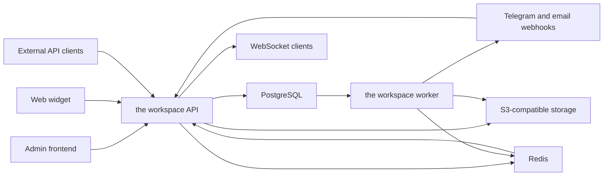

# Backend-архитектура the workspace

Статус: первоначальная архитектура, версия 0.2.

Фундамент и первый вертикальный срез реализованы в `backend/`: один Cargo
package, процессы `api` и `worker`, multi-tenant schema, widget sessions,
conversations/messages, outbox, realtime tickets, resolution/rating, AI-профили
и зашифрованные настройки LM-провайдеров. Внешние Telegram/email-коннекторы,
agent/LLM adapters, product-specific AI tools, attachments и полная
административная конфигурация остаются следующими этапами.

## 1. Назначение системы

the workspace — отдельная multi-tenant платформа клиентских коммуникаций. Она объединяет
web-виджеты, внешний API, Telegram, email и последующие каналы в общий Inbox.

the workspace не является модулем Exchange Platform и не использует её базу напрямую.
Интеграция с Exchange Platform и другими продуктами выполняется через API,
webhooks и SSO.

Основная иерархия:

```text
Tenant
└── Project
    ├── Operators and roles
    └── Inbox
        ├── Channel connections
        ├── Conversations and messages
        ├── AI profiles
        └── Knowledge bases
```

- `Tenant` — организация-владелец данных.
- `Project` — отдельный бренд или продукт.
- `Inbox` — линия коммуникации с назначенными каналами и правилами маршрутизации.
- `ChannelConnection` — динамически настроенный экземпляр канала.
- `Conversation` — нормализованный диалог независимо от источника.

Проекты, Inbox, виджеты, доступ операторов, каналы, почтовые ящики, AI-профили, API-ключи
и webhooks создаются через админку без изменения кода и нового деплоя.

## 2. Архитектурные решения

### 2.1. Модульный монолит

Backend начинается как один Cargo package с двумя бинарниками:

- `api` — HTTP, WebSocket, авторизация и синхронные операции;
- `worker` — outbox, внешняя доставка и фоновые задачи.

Отдельные crates и микросервисы не создаются, пока не появится реальная граница:
отдельный жизненный цикл, несовместимые зависимости, собственное масштабирование
или необходимость изолировать отказ.

TDLib в будущем может получить отдельный бинарник `tdlib-worker`, потому что
каждый Telegram-аккаунт требует долгоживущей сессии и единственного активного
владельца. Это не требует превращать весь backend в микросервисы.

### 2.2. PostgreSQL — источник истины

Сообщения, назначения, настройки, статусы доставки, outbox и аудит хранятся в
PostgreSQL. Redis не содержит единственную копию бизнес-данных.

### 2.3. Надёжная запись раньше доставки

Входящее или исходящее сообщение сначала записывается в PostgreSQL вместе с
outbox-событием. Внешний провайдер никогда не вызывается внутри DB-транзакции.

### 2.4. Изоляция по умолчанию

Каждая операция проверяет tenant, project, Inbox и permission на backend. Скрытие
разделов во frontend не считается контролем доступа.

### 2.5. ИИ работает только с явно разрешёнными данными

Модель не имеет прямого доступа к PostgreSQL, Redis, внутреннему HTTP API или
сети. Для каждого запуска backend формирует закрытый список ресурсов и действий.
Отсутствие разрешения означает отсутствие данных.

## 3. Системная схема



## 4. Структура backend

```text
backend/
├── Cargo.toml
├── Cargo.lock
├── Config.example.toml
├── migrations/
├── openapi/
├── src/
│   ├── lib.rs
│   ├── app.rs
│   ├── config.rs
│   ├── client_ip.rs
│   ├── error.rs
│   ├── visitor_intelligence.rs
│   ├── bin/
│   │   ├── api.rs
│   │   └── worker.rs
│   ├── auth/
│   ├── tenancy/
│   ├── inbox/
│   ├── contacts/
│   ├── conversations/
│   ├── channels/
│   │   ├── widget/
│   │   ├── external_api/
│   │   ├── telegram_bot/
│   │   ├── telegram_business/
│   │   ├── telegram_tdlib/
│   │   └── email/
│   ├── quality/
│   ├── ai/
│   ├── realtime/
│   ├── outbox/
│   └── infrastructure/
│       ├── postgres.rs
│       ├── redis.rs
│       ├── object_storage.rs
│       ├── encryption.rs
│       └── telemetry.rs
└── tests/
```

Папки создаются по мере появления функциональности. Пустые `domain`,
`persistence`, `protocol` и другие формальные границы заранее не добавляются.

Внутри растущего модуля допускаются:

```text
conversations/
├── mod.rs
├── model.rs
├── service.rs
├── repository.rs
└── http.rs
```

Доменные типы и переходы состояний не зависят от Axum и SQLx. HTTP DTO и сырые
payload внешнего провайдера не должны проникать в доменную модель. Traits вводятся
для реальных внешних границ, а не для каждого небольшого repository.

## 5. Ответственность процессов

### API

- operator REST API;
- widget REST API;
- provider webhooks;
- WebSocket endpoint;
- OIDC/SSO, session auth и API keys;
- RBAC и проверка области данных;
- валидация и идемпотентная запись команд;
- выдача presigned URL для вложений;
- health endpoints и OpenAPI.

API не выполняет долгие внешние отправки синхронно.

### Worker

- чтение `outbox_events` через `FOR UPDATE SKIP LOCKED`;
- отправка сообщений во внешние каналы;
- retries с exponential backoff и jitter;
- обновление delivery status;
- синхронизация email и Telegram;
- Web Push;
- durable dispatch в внешний agent runtime и приём готовых ответов;
- обработка вложений и документов;
- периодические reconciliation-задачи;
- очистка сырых visitor-данных по сроку хранения.

После исчерпания попыток задача переходит в терминальное состояние `failed`, но
не удаляется. Повторный запуск выполняется явно и аудируется.

## 6. Модули

### `auth`

- operator sessions, OIDC/SSO и MFA-контекст;
- API keys и service accounts;
- widget visitor tokens;
- permission checks;
- безопасное обновление сессий.

### `tenancy`

- tenants и projects;
- memberships и роли;
- доступ операторов в границах проекта;
- tenant/project-scoped configuration.

### `inbox`

- Inbox;
- доступ операторов в рамках активного проекта;
- правила маршрутизации;
- очередь и назначение операторов;
- рабочие часы и SLA-политики.

### `contacts`

- клиент как внутренняя сущность;
- email, Telegram и widget identities;
- безопасное связывание identities;
- отсутствие автоматического объединения только по похожим данным.

### `conversations`

- conversations и participants;
- messages и internal notes;
- attachments;
- assignment history;
- статусы диалога и сообщения;
- дедупликация внешних событий.

### `channels`

Каждый канал преобразует внешний payload во внутренние команды и события. Общая
модель не хранит provider-specific payload как источник бизнес-логики.

Telegram разделяется на три независимых пути:

- Bot API;
- Telegram Business;
- полноценные аккаунты через TDLib.

Email поддерживает Gmail OAuth/API, iCloud через app-specific password, generic
IMAP/SMTP и будущие provider webhooks. Для threading сохраняются `Message-ID`,
`In-Reply-To` и `References`.

### `quality`

- отдельные циклы разрешения диалога;
- оценка 1–5;
- причины и необязательный комментарий;
- ответственный оператор и, для исторических записей, legacy-команда на момент разрешения;
- CSAT, response rate, first response time, resolution time и reopen rate.

Публичный модуль Reviews не смешивается с оценкой работы поддержки и реализуется
отдельно после MVP.

### `ai`

- политика доступа агента;
- формирование контекста запуска;
- разрешённые tools;
- адаптеры LM-провайдеров;
- tool-call audit;
- human approval для действий с внешним эффектом.

### `realtime`

- WebSocket connections;
- типизированные realtime events;
- fan-out между API-инстансами через Redis;
- восстановление после reconnect через REST cursor.

### `outbox`

- durable events;
- claim/lease задач;
- retry policy;
- идемпотентная доставка;
- reconciliation.

## 7. Модель данных MVP

### Организация и права

| Таблица | Назначение |
| --- | --- |
| `tenants` | Владелец изолированного набора данных |
| `projects` | Бренд или продукт внутри tenant |
| `users` | Учетные записи операторов |
| `memberships` | Роль пользователя внутри tenant/project |
| `teams` | Legacy-команды, сохранённые для совместимости и исторических ссылок |
| `team_members` | Legacy-состав команд |
| `inboxes` | Линии коммуникации |
| `inbox_team_access` | Legacy-настройки доступа; не участвуют в текущей runtime-авторизации |

### Каналы и клиенты

| Таблица | Назначение |
| --- | --- |
| `channel_connections` | Тип, Inbox, публичные настройки и состояние канала |
| `channel_secrets` | Зашифрованные credentials отдельно от обычной конфигурации |
| `contacts` | Внутренний клиент внутри tenant |
| `contact_identities` | Widget, email, Telegram и external identities |
| `widget_sessions` | Отдельные сессии виджета, hash first-party visitor ID и ограниченный контекст устройства/сети |

### Диалоги

| Таблица | Назначение |
| --- | --- |
| `conversations` | Нормализованный диалог |
| `conversation_participants` | Клиенты, операторы и AI-участники |
| `conversation_assignments` | История назначения операторов и legacy-команд |
| `messages` | Клиентские, операторские, AI-сообщения и internal notes |
| `message_deliveries` | Provider message ID и состояние доставки |
| `message_attachments` | Метаданные объектов в S3 |

### Качество поддержки

| Таблица | Назначение |
| --- | --- |
| `conversation_resolutions` | Отдельный цикл закрытия и переоткрытия |
| `support_ratings` | Оценка конкретного resolution |
| `support_rating_reasons` | Причины оценки |

### Инфраструктура и ИИ

| Таблица | Назначение |
| --- | --- |
| `outbox_events` | Надёжные фоновые события |
| `idempotency_keys` | Результаты идемпотентных клиентских команд |
| `inbound_events` | Дедупликация provider events |
| `audit_log` | Неизменяемый журнал значимых действий |
| `ai_provider_connections` | OpenAI, Anthropic и OpenAI-compatible подключения с зашифрованным API key |
| `ai_profiles` | Профили поддержки, видимые произвольные поля и назначения внешнего агента |
| `ai_profile_secrets` | Зашифрованные write-only секреты профиля; значения не возвращаются management API |
| `ai_profile_knowledge_bases` | Назначение баз знаний профилям |
| `ai_profile_channel_connections` | Точное назначение AI-профиля на разрешённые channel connections |
| `ai_profile_public_identities` | Клиентское имя AI-профиля для каждого поддерживаемого языка |
| `ai_profile_public_identity_avatars` | Необязательный клиентский аватар AI-профиля для конкретного языка |
| `inbox_ai_profiles` | Legacy-источник для миграции старых Inbox-назначений в точные channel connections; текущая маршрутизация его не использует |

Каждая бизнес-таблица содержит `tenant_id`. Для связей между tenant-scoped
сущностями применяются составные ограничения, не позволяющие связать данные двух
tenant даже при ошибке application-кода.

Идентификаторы в Rust представлены newtype-типами (`TenantId`, `ProjectId`,
`InboxId`, `ConversationId`), а состояния — enum, а не наборами
boolean-полей.

## 8. Состояния

### Conversation

```text
new → open ↔ waiting_customer → resolved
       ↑                         │
       └──────── reopened ───────┘
```

Переход в `resolved` создаёт `conversation_resolution`. Переоткрытие не изменяет
старый resolution, а начинает новый цикл обслуживания.

### Message delivery

```text
queued → sending → sent → delivered → read
             └──────────────→ failed
```

### Channel connection

```text
draft → connecting → active → degraded
                         └──→ reauth_required
                         └──→ disabled
```

Переходы выполняются доменными методами. Невалидное состояние возвращает ошибку,
а не исправляется молча.

## 9. Потоки сообщений

### Входящее сообщение

1. Adapter проверяет подпись webhook или доверенный transport.
2. Событие дедуплицируется по `connection_id + provider_event_id`.
3. Backend определяет tenant, project и Inbox только из доверенной конфигурации.
4. В одной транзакции создаются или обновляются contact, conversation, message и
   outbox event.
5. После commit worker публикует realtime event.
6. Админка получает событие через WebSocket.

### Исходящее сообщение

1. Клиент отправляет `client_message_id` или HTTP `Idempotency-Key`.
2. Backend проверяет доступ к конкретному Inbox и conversation.
3. Message со статусом `queued` и outbox event сохраняются одной транзакцией.
4. Worker вызывает соответствующий канал.
5. Provider ID и delivery status записываются в `message_deliveries`.
6. Изменение статуса публикуется через realtime.

Повтор запроса с тем же ключом возвращает прежний результат и не создаёт второе
сообщение.

### Сессия web-виджета

1. Loader создаёт случайный visitor UUID и сохраняет его в first-party storage.
2. Каждый mount отправляет новый session bootstrap с точным widget ID, visitor
   UUID и ограниченным browser context.
3. Backend сверяет `Origin` с настройкой канала и с origin переданного page URL,
   отклоняет query/fragment и сокращает referrer до origin. Loader отключает
   browser `Referer`; pathname и title считаются потенциальными персональными
   данными и не должны содержать секреты.
4. IP определяется по непосредственному peer. Канонический
   `X-Tz-Client-IP` принимается только от явно доверенного proxy CIDR и
   только как один bare IP.
5. Backend валидирует UUIDv4 и сразу преобразует его в SHA-256 hash. В
   транзакции с advisory lock он переиспользует widget identity и contact для
   пары `channel_connection_id + visitor_id_hash`, но создаёт новую
   `widget_session` для каждого mount. Исходный UUID в БД и аудит не попадает.
6. При разрешённом чтении visitor intelligence backend локально обогащает
   сохранённый IP через GeoLite2 City/Country и разбирает raw user-agent в
   browser, OS и тип устройства. Производные поля отдельно в БД не сохраняются.
7. Raw IP, user-agent, языки, client hints и browser context очищаются worker по
   настроенному retention; после этого GeoIP/user-agent enrichment недоступен,
   а contact, conversation и факт сессии сохраняются.

## 10. Внешние AI-провайдеры

the workspace не реализует собственный LLM loop, планировщик или каталог model tools.
Профили, назначения на конкретные channel connections, локализованные публичные
имена и аватары, отображение участника, сообщения и human handoff остаются
доменной частью the workspace.

Настройки подключений к OpenAI, Anthropic и OpenAI-compatible endpoints хранятся
в the workspace: base URL, зашифрованный API key, default model, override модели в
профиле, temperature и лимит ответа. Reply worker использует generic
OpenAI-compatible dispatcher для типов `openai` и `openai_compatible`.

### 10.1. Граница интеграции

Generic dispatcher отправляет в выбранный provider инструкции профиля,
ограниченный контекст назначенной базы знаний и историю диалога. В контекст
попадают только непустые опубликованные статьи активных баз того же tenant и
project, язык которых совместим с языком widget-сессии исходного сообщения.
Основной тег совместим с региональным (`ru` и `ru-RU`), но разные языки и две
разные явно заданные региональные разновидности не смешиваются. То же правило
применяется к самому AI-профилю: профиль `ru` не подключается к widget-сессии
`en`, а список `ru, en` разрешает обе. При отсутствующем, некорректном или
несовместимом языке AI-participant и provider job не создаются; worker повторяет
проверку перед внешним вызовом на случай изменения профиля после постановки
задачи в очередь. Черновики, архивные и неназначенные базы исключаются.
Инструкции профиля имеют приоритет, а материалы базы не расширяют доступ к
данным или инструментам.

Готовый ответ возвращается как обычное исходящее AI-сообщение. Оператор может
атомарно вернуть ранее переданный ему диалог прежнему доступному AI-профилю;
новые сообщения и последнее оставшееся без ответа сообщение снова попадают в
его очередь. В текущей реализации входящее сообщение создаёт durable outbox
job, а отдельный worker вызывает `POST {base_url}/chat/completions` с
`Idempotency-Key`, равным UUID входящего сообщения. Перед сохранением ответа
worker повторно проверяет, что AI-профиль активен, относится к текущему циклу
участия и живой оператор не вступил в диалог; поэтому запоздавший ответ после
handoff не публикуется.

Один mutable agent context нельзя совместно использовать между разными tenant
или контактами. Mapping внешнего состояния обязан включать как минимум tenant,
project, AI profile и contact; общими могут быть только read-only инструкции.

### 10.2. Инструменты

В the workspace нет захардкоженных названий или контрактов model tools. Доступ к
бизнес-системам должен предоставляться отдельными узкими API с tenant/project
scope, permissions, idempotency и audit. Модели не получают пароль от основной
PostgreSQL the workspace и не выполняют произвольный SQL.

### 10.3. Внешние действия

Для действий с побочным эффектом tool adapter повторно проверяет права,
использует idempotency key и при необходимости требует подтверждение оператора.
Вызовы инструментов и итоговые решения доступны для аудита; промпт не заменяет
серверную авторизацию.

## 11. Авторизация и безопасность

Для каждого запроса создаётся `ActorContext`:

```text
actor_id
tenant_id
project_scope
inbox_scope
role
permissions
auth_method
```

Repository принимает scope явно; методы без tenant scope для бизнес-данных не
создаются.

Дополнительные правила:

- widget ID является публичным, а не секретным;
- Origin проверяется по allowlist виджета;
- client IP header игнорируется от недоверенного peer; wildcard proxy CIDR
  запрещены, а отсутствующий, составной или невалидный header от доверенного
  proxy отклоняет widget-session запрос;
- visitor token ограничен собственными conversations;
- visitor intelligence доступен только ролям `admin` и `manager` по permission
  `visitor_network:read`, только через password session, tenant/project/Inbox
  scope и с redacted audit event; access tokens всегда запрещены, а HTTP-ответ
  помечается `Cache-Control: no-store`;
- raw visitor intelligence имеет ограниченный retention и очищается без
  удаления contact или истории сессий;
- GeoIP работает по локальным MaxMind-файлам без внешнего запроса, а страна,
  город, browser и OS вычисляются при чтении и не переживают очистку raw данных;
- password хранится как Argon2id hash;
- browser session и CSRF token хранятся на сервере только как SHA-256 hashes;
- session cookie имеет `HttpOnly`, `SameSite=Strict` и `Secure` в production;
- unsafe session-запросы требуют совпадающие CSRF cookie/header;
- access tokens имеют фиксированную роль, Inbox scope, обязательный срок и
  хранятся только как hash; plaintext показывается один раз;
- access token, включая роль `admin`, не может выпускать или отзывать токены;
- роли the workspace — фиксированные permission presets, не лицензируемые modules;
- OAuth refresh tokens, SMTP credentials, bot tokens и TDLib sessions шифруются;
- секреты никогда не возвращаются во frontend после сохранения;
- provider webhooks проверяют подпись или secret token;
- rate limit для login, widget session, messages и webhooks является
  обязательной защитой; до реализации общего backend limiter публичные routes
  дополнительно ограничиваются на ingress;
- важные чтения и все изменения аудируются;
- cross-tenant доступ проверяется отрицательными тестами.

PostgreSQL RLS можно добавить как второй слой защиты после стабилизации схемы,
но она не заменяет application authorization.

## 12. Realtime

WebSocket используется для оперативной доставки событий, но не является
источником истории.

Пример события:

```json
{
  "type": "message.created",
  "sequence": 1042,
  "conversation_id": "0190...",
  "data": {}
}
```

Правила:

- событие публикуется только после commit;
- Redis Pub/Sub используется для fan-out между API-инстансами;
- каждое событие фильтруется по текущему actor scope;
- после reconnect клиент запрашивает REST history по cursor;
- пропущенное WebSocket-событие не приводит к потере данных.

## 13. Вложения

PostgreSQL хранит метаданные, а бинарные данные — S3-compatible storage.

- endpoint и credentials внешнего S3-compatible storage задаются в конфиге
  приложения после реализации поддержки вложений;
- upload/download выполняются через короткоживущие presigned URL;
- object key формируется backend и включает tenant scope;
- размер, MIME type и checksum проверяются;
- антивирусная проверка добавляется как фоновая задача;
- отключённая поддержка файлов не должна ломать readiness.

Object storage не является обязательной частью MVP, если первый вертикальный
срез не поддерживает вложения.

## 14. API

API разделяется по назначению:

```text
/api/v1/...          operator and administration API
/widget/v1/...       public widget API
/webhooks/v1/...     provider callbacks
/ws                  authenticated realtime connection
/health/live
/health/ready
```

Общие правила:

- OpenAPI является проверяемым контрактом;
- cursor pagination вместо offset для сообщений и событий;
- единый error envelope с `code`, `message`, `request_id`;
- PATCH-команды проверяют ожидаемую version для защиты от lost update;
- webhook и POST-команды идемпотентны;
- время передаётся в UTC в формате RFC 3339;
- внешние идентификаторы провайдера не используются как внутренние ID.

## 15. Инфраструктура

### PostgreSQL

- основной durable store;
- SQLx migrations;
- транзакции для message + outbox;
- индексы начинаются с tenant scope;
- connection pool ограничивается отдельно для API и worker.

### Redis

- realtime Pub/Sub;
- rate limits;
- короткие distributed locks;
- TDLib leases;
- ephemeral presence и typing state.

Redis не используется как единственная durable очередь.

### Object storage

- единый S3 API boundary;
- внешний S3-compatible storage задаётся через конфиг приложения.

## 16. Наблюдаемость

- structured JSON logs;
- `request_id`, `trace_id`, `tenant_id`, `project_id` и actor ID в безопасном
  контексте логов;
- OpenTelemetry traces для API, SQL и worker jobs;
- метрики latency, error rate, queue depth, retry count и delivery failures;
- отдельные метрики channel connection health;
- секреты, message body и полные tool results в логи не пишутся;
- liveness проверяет процесс, readiness — только включённые обязательные
  зависимости.

## 17. Тестирование

### Unit tests

- переходы состояний conversation/message/connection;
- routing rules;
- permission policy;
- нормализация provider connections и AI profiles;
- retry/backoff calculations.
- trusted-proxy client IP resolution и отказ для неоднозначных headers;
- нормализация и границы widget browser context.

### Integration tests

- SQLx repositories на реальном PostgreSQL;
- migrations up на чистой базе;
- message + outbox atomicity;
- idempotency и provider-event deduplication;
- tenant/project/Inbox isolation;
- worker claim с конкурентными процессами.

### Contract tests

- provider webhook signatures;
- Telegram Bot и Business payloads отдельно;
- email threading;
- OpenAPI compatibility с frontend client.
- Origin/CORS контракт widget-session и operator visitor-intelligence contract.

### Обязательные тесты внешнего agent adapter

- внешний conversation/run ID нельзя переиспользовать между tenant или contact;
- повтор одного события не создаёт второй ответ;
- ответ, пришедший после вступления живого оператора, не публикуется;
- секреты provider/profile никогда не сериализуются во frontend или prompt;
- MCP/client tool с побочным эффектом повторно проверяет права и idempotency;
- prompt injection не расширяет права tool adapter.

## 18. Первоначальный порядок реализации

### Этап 1. Основа

- один Cargo package;
- `api` и `worker`;
- config, errors, telemetry;
- PostgreSQL migrations;
- health endpoints;
- CI: fmt, Clippy, tests и build.

### Этап 2. Multi-tenancy

- tenant, project, user, memberships;
- Inbox, доступ операторов по проектам и серверный RBAC;
- audit log.

### Этап 3. Первый вертикальный срез

```text
Widget configuration
→ visitor session
→ conversation
→ inbound message
→ operator Inbox
→ operator reply
→ WebSocket delivery
```

### Этап 4. Работа поддержки

- assignments;
- internal notes;
- waiting/resolved/reopened states;
- resolution cycle;
- оценка 1–5 и CSAT.

### Этап 5. Надёжная интеграция

- outbox worker;
- retries и reconciliation;
- External API;
- Web Push.

### Этап 6. Каналы

1. Telegram Bot API;
2. Telegram Business;
3. Gmail OAuth/API;
4. iCloud и generic IMAP/SMTP;
5. TDLib accounts.

### Этап 7. AI

- LM provider connections и profiles;
- OpenAI-compatible reply dispatcher через durable outbox;
- knowledge base;
- узкие внешние tools, настраиваемые отдельно от исходного кода the workspace;
- human handoff и approval для действий с побочным эффектом.

### Этап 8. Post-MVP

- публичный Reviews module;
- AI-анализ отзывов без генерации фиктивных отзывов;
- дополнительные каналы;
- отдельные сервисы только при подтверждённой эксплуатационной необходимости.

## 19. Что сознательно не делаем в начале

- не создаём много маленьких crates;
- не разбиваем backend на микросервисы;
- не добавляем Kubernetes;
- не делаем object storage обязательным без файлового сценария;
- не вызываем внешних провайдеров внутри DB-транзакции;
- не связываем the workspace с базой Exchange Platform;
- не встраиваем в the workspace product-specific каталог agent tools и unrestricted
  доступ к основной БД; возможности подключаются через внешний adapter/MCP;
- не смешиваем CSAT поддержки и публичные Reviews;
- не начинаем с AI до появления надёжного потока сообщений и авторизации.
